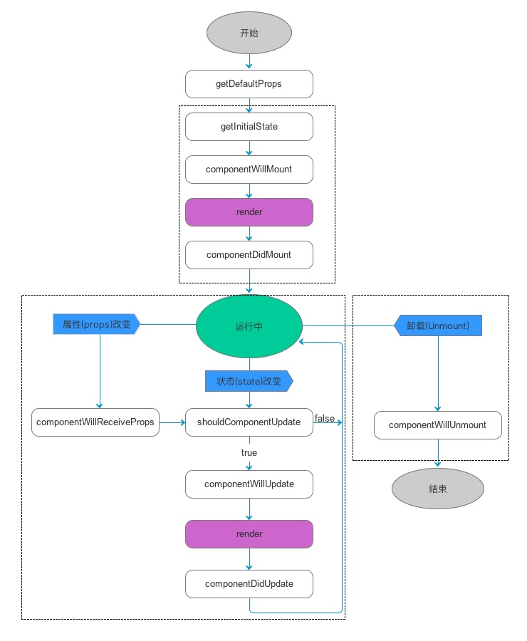

# ReactJS 框架 入门

官网： https://reactjs.org/

官方一句很简单的话，道出了什么是ReactJS，就是，一个用于构建用户界面的JavaScript框架，是Facebook开发的

一款的JS框架。

ReactJS把复杂的页面，拆分成一个个的组件，将这些组件一个个的拼装起来，就会呈现多样的页面。ReactJS可以用

于 MVC 架构，也可以用于 MVVM 架构，或者别的架构。

~~~js
环境准备
首先得有 node，并确保 node 版本是 10.13 或以上。（mac 下推荐使用 nvm 来管理 node 版本）

~~~

## React快速入门

### JSX语法
JSX语法就是，可以在js文件中插入html片段，是React自创的一种语法。
JSX语法会被Babel等转码工具进行转码，得到正常的js代码再执行。
使用JSX语法，需要2点注意：

1. 所有的html标签必须是闭合的，如： 
hello

2. 在JSX语法中，只能有一个根标签；
如果想要在html标签中插入js脚本，需要通过{}插入js脚本。
如： 
~~~js
function greeting(name){
	if(name){
		return <h1>Hello {name}</h1>;
	}
	return <h1>hello anno!</h1>
}

export default () => {
	return 
{greeting('Tekin')}
;
}
~~~

### 组件
组件是React中最重要也是最核心的概念，一个网页，可以被拆分成一个个的组件：

- 在React中，这样定义一个组件：

~~~js
import React from 'react'; //第一步，导入React
class HelloWorld extends React.Component { //第二步，编写类并且继承 React.Component
render(){ //第三步，重写render()方法，用于渲染页面
return 
hello world!
 //JSX语法
}
}
export default HelloWorld; //第四步，导出该类
~~~

- 导入自定义组件

创建Show.js文件，用于测试导入组件：

~~~js
import React from 'react'
import HelloWorld from './HelloWorld' //导入HelloWorld组件
class Show extends React.Component{
render(){
return <HelloWorld/>; //使用HelloWorld组件
}
}
export default Show;
~~~

####组件参数

组件是可以传递参数的，有2种方式传递，分别是属性和标签包裹的内容传递，具体使用如下：

~~~js
import React from 'react'
import HelloWorld from './HelloWorld' //导入HelloWorld组件
class Show extends React.Component{
  render(){
  	return <HelloWorld name="zhangsan">shanghai</HelloWorld>; //使用HelloWorld组件
  }
}
export default Show;
~~~

其中，name="zhangsan"就是属性传递，shanghai就是标签包裹的内容传递。

那么，在HelloWord.js组件中如何接收参数呢？

对应的也是2种方法：

**属性：this.props.name 接收；**

**标签内容：this.props.children 接收；**

使用如下：

~~~js
import React from 'react'; //第一步，导入React
class HelloWorld extends React.Component { //第二步，编写类并且继承 React.Component
  render(){ //第三步，编写render()方法，用于渲染页面
  return 
hello world! name={this.props.name}, address={this.props.children}
 //JSX语法
  }
}
export default HelloWorld; //第四步，导出该类
~~~

#### 组件的状态

每一个组件都有一个状态，其保存在this.state中，当状态值发生变化时，React框架会自动调用render()方法，重新

渲染页面。

其中，要注意两点：

一： this.state值的设置要在构造参数中完成；

二：要修改this.state的值，需要调用this.setState()完成，不能直接对this.state进行修改；

下面通过一个案例进行演示，这个案例将实现：通过点击按钮，不断的更新this.state，从而反应到页面中。

~~~js
import React from 'react';

class List extends React.Component {
    constructor(props) {
        super(props);
        this.state = {
            dataList: [1, 2, 3, 4, 5],
            maxNum: 5
        }
    }
    render(){
        return (

            <ul>
                {
                    this.state.dataList.map((val,index) => {
                        return <li key={index}>{ val }</li>
                    })
                }

            </ul>
            <button onClick={() => {
                let mNum = this.state.maxNum+1;
                let newArr = [...this.state.dataList, mNum];

                this.setState({
                    dataList: newArr,
                    maxNum: mNum
                })
             }}>点我</button>
        
);
    };
}

export default List;
~~~

####生命周期

组件的运行过程中，存在不同的阶段。React 为这些阶段提供了钩子方法，允许开发者自定义每个阶段自动执行的函

数。这些方法统称为生命周期方法（lifecycle methods）。

生命周期示例：

~~~js
import React from "react"; //第一步，导入React
class LifeCycle extends React.Component {
  constructor(props) {
    super(props);
    //构造方法
    console.log("constructor()");
  }
  componentDidMount() {
    //组件挂载后调用
    console.log("componentDidMount()");
  }
  componentWillUnmount() {
    //在组件从 DOM 中移除之前立刻被调用。
    console.log("componentWillUnmount()");
  }
  componentDidUpdate() {
    //在组件完成更新后立即调用。在初始化时不会被调用。
    console.log("componentDidUpdate()");
  }
  shouldComponentUpdate(nextProps, nextState) {
    // 每当this.props或this.state有变化，在render方法执行之前，就会调用这个方法。
    // 该方法返回一个布尔值，表示是否应该继续执行render方法，即如果返回false，UI 就不会更新，默认返回true。
    // 组件挂载时，render方法的第一次执行，不会调用这个方法。
    console.log("shouldComponentUpdate()");
  }
  render() {
    return (
      

        <h1>React Life Cycle!</h1>
      

    );
  }
}
export default LifeCycle;

~~~

## Model

Controller、Service、Data Access 三层组

成服务端系统：

Controller 层负责与用户直接打交道，渲染页面、提供接口等，侧重于展示型逻辑。

Service 层负责处理业务逻辑，供 Controller 层调用。

Data Access 层顾名思义，负责与数据源对接，进行纯粹的数据读写，供 Service 层

调用。

上图的右侧是前端代码的结构，同样需要进行必要的分层：

Page 负责与用户直接打交道：渲染页面、接受用户的操作输入，侧重于展示型交互

性逻辑。

Model 负责处理业务逻辑，为 Page 做数据、状态的读写、变换、暂存等。

Service 负责与 HTTP 接口对接，进行纯粹的数据读写。

### 使用DVA进行数据分层管理

dva是基于 redux、redux-saga 和 react-router 的轻量级前端框架。官

网：https://dvajs.com/

首先，我们先将dva框架引入进来，由于umi对dva进行了整合，所以导入就变得非常简

单了。

在config.js文件中进行配置：

~~~js
export default {
plugins: [
  ['umi‐plugin‐react', {
 		 dva: true // 开启dva功能
  }]
  ]
};
~~~

接下来，创建model文件，在umi中，约定在src/models文件夹中定义model，所以，在
该文件夹下创建listdemo.js文件：
~~~js
export default {
  namespace: 'listdemo',
  state: {
    data: [8, 9, 3, 2, 1],
    maxNum: 0,
  },
};
~~~
然后在 pages 文件夹中创建 
listdemo.js文件，内容如下
~~~js
import React from "react";
import { connect } from "dva";

const nsName = "listdemo"; //这里的命名空间名称就是models中模型定义的命名空间名称
//说明： 第一个回调函数，作用 将 page层和model层进行链接，返回model中的数据，
// 并且将返回的数据绑定到 this.props 中， 后面render中使用 this.props.xx就可以访问
@connect((state) => {
  return {
    dataList: state[nsName].data,
    maxNum: state[nsName].maxNum,
  };
})
class ListDemo extends React.Component {
  constructor(props) {
    super(props);
  }
  render() {
    return (
      

        <ul>
          {// 遍历值
          this.props.dataList.map((value, index) => {
            return <li key={index}>{value}</li>;
          })}
        </ul>
        <button>添加</button>
      

    );
  }
}

export default ListDemo; //注意这里必须要导出，否则页面不会显示内容
~~~

## 流程说明：
1. umi框架启动，会自动读取models目录下model文件，即ListData.js中的数据

2. @connect 修饰符的第一个参数，接收一个方法，该方法必须返回 {}，将接收到model数据

3. 在全局的数据中，会有很多，所以需要通过namespace进行区分，所以通过 state[namespace] 进行获取数据

4. 拿到model数据中的data，也就是[8, 9, 3, 2, 1]数据，进行包裹{}后返回

5. 返回的数据，将被封装到this.props中，所以通过this.props.dataList即可获取到

### model中的数据
刚刚只是将数据展现出来，如果点击按钮，需要修改state的值，怎么操作呢？
首先，在model中新增reducers方法，用于更新state中的数据：
models/ListData.js
~~~js
export default {
    namespace: 'list',
    state: {
        data: [1, 2, 3],
        maxNum: 3
    },
    reducers : {
        addNewData(state){ //state是更新前的对象
            let maxNum = state.maxNum + 1;
            let list = [...state.data, maxNum];
            return { // 返回更新后的state对象
                data : list,
                maxNum : maxNum
            }
        }
    }
}
~~~

接下来修改List.js新增点击事件：

~~~js
import React from "react";
import { connect } from "dva";
const namespace = "list";
const mapStateToProps = (state) => {
  const listData = state[namespace].data;
  const maxNum = state[namespace].maxNum;
  return {
    listData,
    maxNum,
  };
};
const mapDispatchToProps = (dispatch) => {
  // 定义方法，dispatch是内置函数
  return {
    //返回的这个对象将绑定到this.props对象中
    addNewData: () => {
      // 定义方法
      dispatch({
        // 通过调用dispatch()方法，调用model中reducers的方法
        type: namespace + "/addNewData", // 指定方法，格式：namespace/方法名
      });
    },
  };
};
@connect(mapStateToProps, mapDispatchToProps) //mapDispatchToProps：函数，将方法映射到props中
class List extends React.Component {
  render() {
    return (
      

        <ul>
          {// 遍历值
          this.props.listData.map((value, index) => {
            return <li key={index}>{value}</li>;
          })}
        </ul>
        <button
          onClick={() => {
            this.props.addNewData();
          }}
        >
          添加
        </button>
      

    );
  }
}
export default List;

~~~

###在model中请求数据

前面我的数据是写死在model中的，实际开发中，更多的是需要异步加载数据，那么在

model中如何异步加载数据呢？

首先，创建src下创建util目录，并且创建request.js文件，输入如下内容：（用于异步请

求数据）

~~~js
// import fetch from 'dva/fetch';
function checkStatus(response) {
  if (response.status >= 200 && response.status < 300) {
    return response;
  }
  const error = new Error(response.statusText);
  error.response = response;
  throw error;
}
/**
 * Requests a URL, returning a promise.
 *
 * @param {string} url The URL we want to request
 * @param {object} [options] The options we want to pass to "fetch"
 * @return {object} An object containing either "data" or "err"
 */
export default async function request(url, options) {
  const response = await fetch(url, options);
  checkStatus(response);
  return await response.json();
}

~~~

然后，在model中新增请求方法：

~~~js
import React from "react";
import { connect } from "dva";
const namespace = "list";
const mapStateToProps = (state) => {
  const listData = state[namespace].data;
  const maxNum = state[namespace].maxNum;
  return {
    listData,
    maxNum,
  };
};
const mapDispatchToProps = (dispatch) => {
  return {
    addNewData: () => {
      dispatch({
        type: namespace + "/addNewData",
      });
    },
    initData: () => {
      //新增初始化方法的定义
      dispatch({
        type: namespace + "/initData",
      });
    },
  };
};
@connect(mapStateToProps, mapDispatchToProps)
class List extends React.Component {
  componentDidMount() {
    this.props.initData(); //组件加载完后进行初始化操作
  }
  render() {
    return (
      

        <ul>
          {// 遍历值
          this.props.listData.map((value, index) => {
            return <li key={index}>{value}</li>;
          })}
        </ul>
        <button
          onClick={() => {
            this.props.addNewData();
          }}
        >
          添加
        </button>
      

    );
  }
}
export default List;

~~~

## mock数据

umi中支持对请求的模拟，只需要在项目根目录下创建 mock目录，然后把要模拟的接口文件放到这个文件夹下即可。

MockListData.js文件示例：

~~~js
export default {
  //模拟请求返回数据
  "get /ds/list": function(req, res) {
    res.json({
      data: [1, 2, 3, 4],
      maxNum: 4,
    });
  },
  
};

~~~

